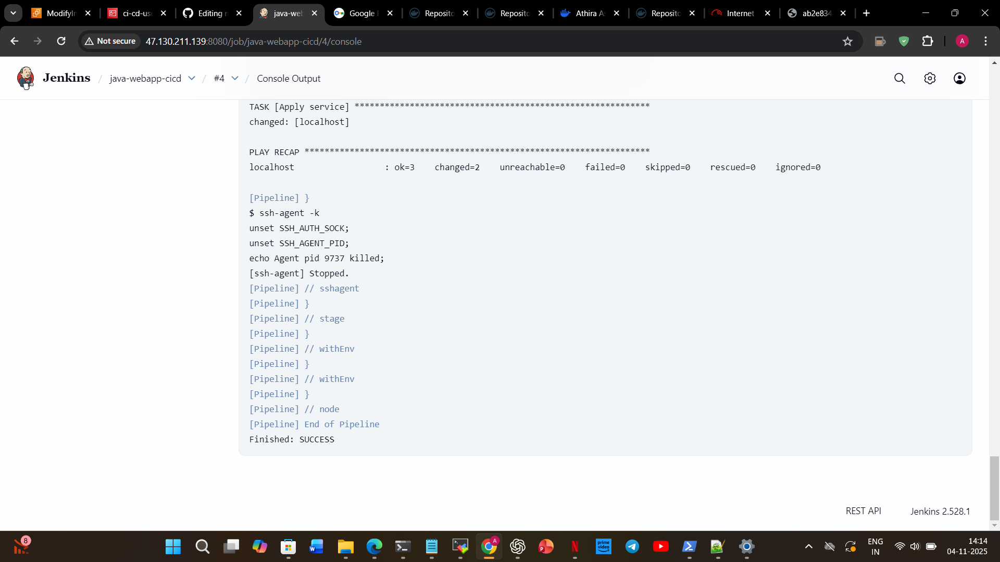
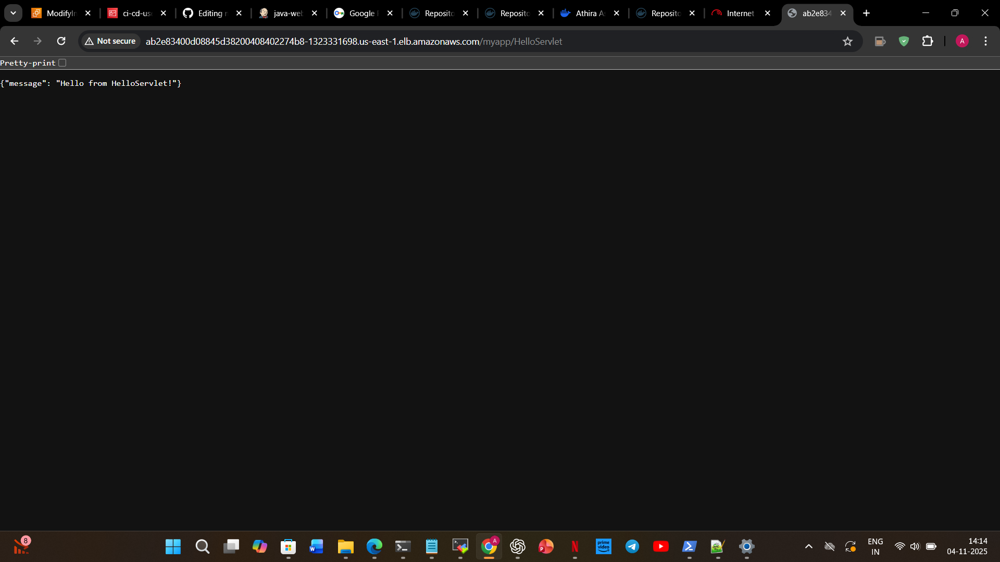

## 🚀 Java Web App CI/CD Pipeline on AWS (GitHub → Jenkins → Ansible → Docker → Kubernetes)

This project demonstrates a **complete end-to-end CI/CD pipeline** for a Java-based web application — from **source code commit to live deployment** on a Kubernetes (EKS) cluster, fully automated using Jenkins, Ansible, Docker, and AWS.

---

## 🏗️ Architecture Overview

**Workflow:**
> Developer → GitHub → Jenkins → Ansible → Docker → Docker Hub → Kubernetes (EKS) → AWS LoadBalancer → End User

---

## ⚙️ Tools & Technologies

| Tool / Service | Purpose |
|----------------|----------|
| **GitHub** | Source Code Management (SCM) and Webhook trigger |
| **Jenkins** | CI/CD orchestration, pipeline automation |
| **Maven** | Java build automation (`.war` generation) |
| **Docker** | Containerization of the web application |
| **Docker Hub** | Central image registry |
| **Ansible** | Automates Docker build & Kubernetes deployment |
| **Kubernetes (EKS)** | Container orchestration & auto-scaling |
| **Tomcat** | Java web server runtime for the WAR |
| **AWS EC2** | Hosts Jenkins, Docker, and Ansible nodes |
| **AWS LoadBalancer** | Exposes the application to the public |

---

## 🔄 CI/CD Workflow

### **1️⃣ Developer Stage**
- Developer commits & pushes code to GitHub.
- GitHub webhook triggers Jenkins automatically.

### **2️⃣ Jenkins (CI Stage)**
- Jenkins pulls latest code from GitHub.
- Runs `mvn clean package` to build the WAR file.
- Builds the Docker image from the Dockerfile.
- Pushes the image to **Docker Hub** (`athiraasok/myapp:latest`).

### **3️⃣ Jenkins (CD Stage)**
- Jenkins triggers **Ansible playbooks** to:
  - Connect to Kubernetes (EKS).
  - Apply `deployment.yaml` and `service.yaml`.
- Kubernetes automatically rolls out the new version.

### **4️⃣ Kubernetes (EKS Stage)**
- Pods are created from the latest Docker image.
- AWS LoadBalancer exposes the app publicly.

### **5️⃣ Verification**
- Verify app is live using:
  ```bash
  curl http://<loadbalancer-dns>/myapp/HelloServlet


Output:

{"message": "Hello from HelloServlet!"}

## 🧩 Project Folder Structure


```
my_java_webapp/
├── ansible/
│   ├── playbook_docker.yml
│   └── k8s_deploy.yml
│
├── java-web-app/
│   ├── pom.xml
│   └── src/
│       ├── main/java/api/servlet/HelloServlet.java
│       └── main/webapp/WEB-INF/web.xml
│
├── k8s/
│   ├── deployment.yaml
│   └── service.yaml
│
├── screenshots/
│   ├── jenkins-dashboard.png
│   ├── kubectl-get-pods.png
│   └── loadbalancer-output.png
│
├── Dockerfile
├── Jenkinsfile
└── README.md
```


🧱 Key Kubernetes Files

deployment.yaml

apiVersion: apps/v1
kind: Deployment
metadata:
  name: myapp-deployment
spec:
  replicas: 2
  selector:
    matchLabels:
      app: myapp
  template:
    metadata:
      labels:
        app: myapp
    spec:
      containers:
      - name: myapp
        image: athiraasok/myapp:latest
        ports:
        - containerPort: 8080

service.yaml

apiVersion: v1
kind: Service
metadata:
  name: myapp-service
spec:
  type: LoadBalancer
  selector:
    app: myapp
  ports:
  - port: 80
    targetPort: 8080

🧠 Key Learnings

✅ Implemented a multi-server CI/CD pipeline from scratch
✅ Automated build, push, and deploy using Jenkins + Ansible + EKS
✅ Set up GitHub webhook → Jenkins trigger for real-time updates
✅ Debugged & managed EKS, LoadBalancer, and AWS IAM permissions
✅ Deployed & scaled a Java web app in Kubernetes

🌐 Live Verification

LoadBalancer URL:
🔗 Click to View Application

Expected Output:

{"message": "Hello from HelloServlet!"}

## 📸 Project Screenshots

Below are the screenshots showing different stages of the CI/CD pipeline:

### 🧩 Jenkins Build Success


### ☸️ Kubernetes Pods Running


### 🌐 Application via AWS LoadBalancer



💼 Author

👤 Athira Asok (Abhin’s Project)

💻 DevOps Engineer (GitHub → Jenkins → Docker → K8s → AWS)

🌍 Docker Hub: athiraasok

🧩 GitHub Repo
